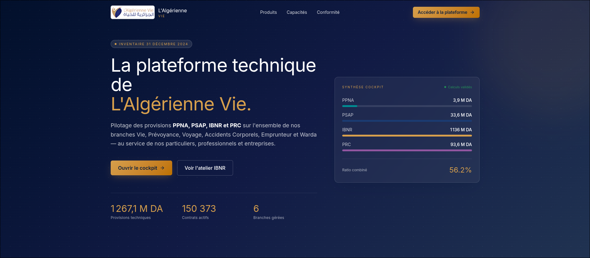
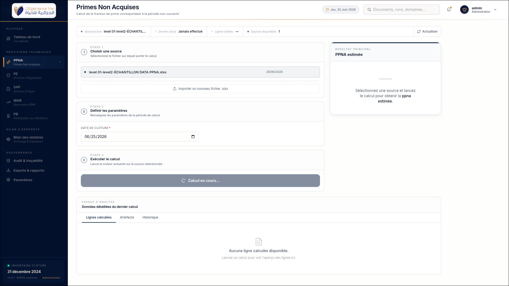
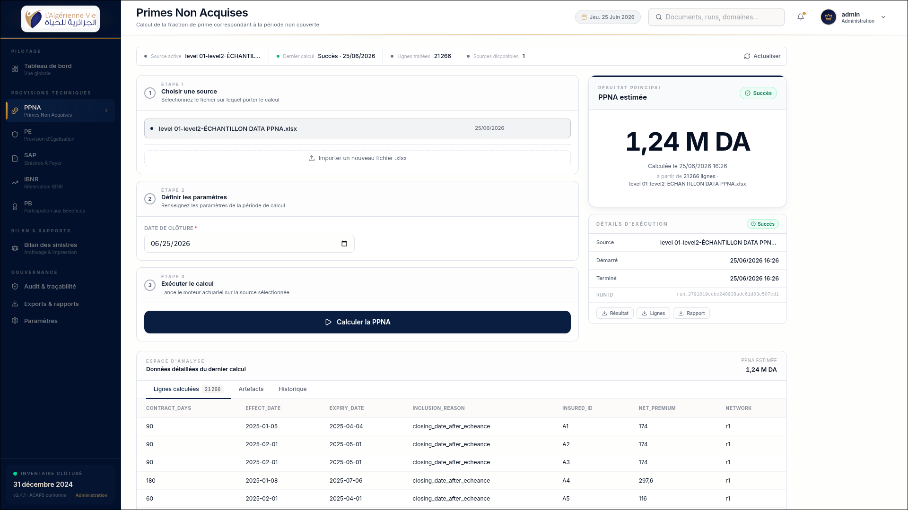
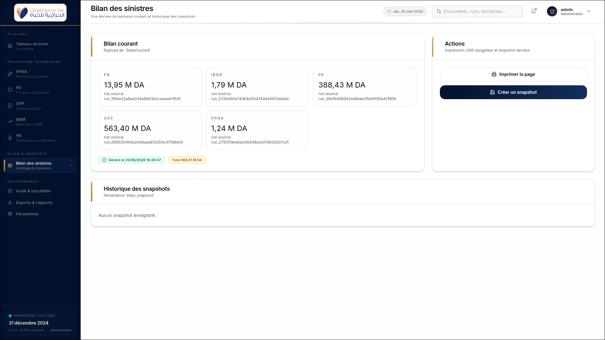

# OpenData - L'Algerienne Vie Actuarial Provisioning Platform

This is a full-stack actuarial provisioning product for L'Algerienne Vie. It combines a French-language insurance cockpit with a FastAPI backend that ingests Excel workbooks, normalizes actuarial data, runs technical provision calculations, stores auditable artifacts, and builds consolidated bilan snapshots.

This README is written as product context for another LLM. Treat the screenshots below as required context: they show the intended product surface, visual language, navigation, terminology, and user workflow. Treat the code as the source of truth for implemented behavior.

## Screenshots Are Required Product Context

### Public Landing Page



The landing page positions the product as "La plateforme technique de L'Algerienne Vie" for the inventory period "Inventaire 31 decembre 2024". It presents the app as a cockpit for `PPNA`, `PSAP`, `IBNR`, and `PRC` across Vie, Prevoyance, Voyage, Accidents Corporels, Emprunteur, and Warda.

Visible product cues:

- Brand: L'Algerienne Vie logo and dark navy/gold institutional palette.
- Main promise: technical provisioning and actuarial steering.
- Primary actions: "Ouvrir le cockpit" and "Voir l'atelier IBNR".
- High-level metrics: `1267,1 M DA` technical provisions, `150 373` active contracts, `6` managed branches.
- Cockpit summary: PPNA, PSAP, IBNR, PRC and combined ratio.

### PPNA Calculation In Progress



This screenshot shows the authenticated workspace for "Primes Non Acquises". The page is organized around a repeatable provision workflow:

1. Choose an active source workbook.
2. Define calculation parameters, such as `Date de cloture`.
3. Execute the actuarial run.

The right panel shows the main result area before completion. The lower analysis area has tabs for calculated rows, artifacts, and history. The left sidebar defines the product information architecture.

### PPNA Successful Run



This screenshot shows the same PPNA workspace after a successful backend run:

- Result: `PPNA estimee = 1,24 M DA`.
- Run status: `Succes`.
- Processed rows: `21 266`.
- Source file: `level 01-level2-ECHANTILLON DATA PPNA.xlsx`.
- Download actions: result, rows, report.
- Row-level audit table: contract days, effect date, expiry date, inclusion reason, insured ID, net premium, network.

The important product point: this is not a static dashboard. It is a calculation workspace that receives a source, launches a backend run, and renders persisted run output.

### Bilan Des Sinistres



This screenshot shows consolidated reporting from the latest successful runs:

- Domain totals: `PB`, `IBNR`, `PE`, `SAP`, `PPNA`.
- Each total carries a source run ID.
- Grand total: `968,81 M DA`.
- Actions: print the page and create a server-side snapshot.
- Snapshot history: persisted `bilan_snapshot` records.

This is the product's management/reporting layer. It turns individual provision runs into a current technical balance that can be archived.

## Product Summary

OpenData is a technical-provisioning cockpit for insurance inventory work. It is built for actuaries, finance users, administrators, and auditors who need to calculate, inspect, and preserve reserve/provision outputs from structured Excel workbooks.

The platform's core values are:

- actuarial correctness against workbook-backed formulas
- traceability from final totals back to source rows
- auditability through immutable artifacts and a hash-chained audit log
- role-based control over upload, run, user management, and read-only access
- professional French insurance terminology and UI behavior

The product is not a generic BI dashboard and not a generic spreadsheet viewer. It is a domain-specific provisioning system.

## Repository Layout

```text
openData/
  frontend/        React + TanStack Router + Vite application
  backend/         FastAPI backend, actuarial engines, data contracts, tests
  screenshots/     Required product screenshots used as visual/context reference
  start.sh         Starts backend and frontend together
  BACKEND_TICKETS.md
```

Important frontend paths:

- `frontend/src/routes/index.tsx`: public landing page shown in `screenshots/landing.png`.
- `frontend/src/routes/app.tsx`: authenticated application shell.
- `frontend/src/components/layout/Sidebar.tsx`: app navigation and inventory status.
- `frontend/src/components/layout/Topbar.tsx`: page title, date, search, notifications, user menu.
- `frontend/src/components/backend/DomainWorkspace.tsx`: reusable upload/run/result workspace for PPNA, SAP, PE, PB, and IBNR.
- `frontend/src/routes/app.ppna.tsx`, `app.sap.tsx`, `app.pe.tsx`, `app.pb.tsx`, `app.ibnr.tsx`: domain-specific pages.
- `frontend/src/routes/app.balance.tsx`: "Bilan des sinistres" page shown in `screenshots/bilan_des_sinistres.png`.
- `frontend/src/lib/backend-api.ts`: typed frontend API client.
- `frontend/src/lib/mockData.ts`: landing/product mock metrics derived from available source files.

Important backend paths:

- `backend/src/backend/app.py`: FastAPI app and route definitions.
- `backend/src/backend/services.py`: service layer for auth, documents, runs, dashboard, bilan, and audit.
- `backend/src/backend/database.py`: SQLite schema.
- `backend/src/preprocessing/`: Excel loading, canonical schemas, normalization, cleaning reports, lineage.
- `backend/src/provisions/`: actuarial calculation engines.
- `backend/src/config/legislative.yaml`: configurable coefficients and actuarial defaults.
- `backend/data/`: sample/source Excel workbooks. Treat these as read-only source inputs.
- `backend/storage/`: local persisted SQLite database, uploaded files, derived files, run artifacts, and snapshots.
- `backend/frontend_api_integration_llm.md`: detailed API contract for frontend/LLM integration.
- `backend/README.md`: backend-focused implementation context.

## Implemented Full-Stack Flow

The implemented product flow is:

1. User lands on `/` and sees the branded public product page.
2. User enters `/app`.
3. If no backend session exists, `AuthGate` handles bootstrap/login.
4. Authenticated users see the app shell with sidebar and topbar.
5. A domain page such as `/app/ppna` loads documents and latest run from the backend.
6. Admin uploads an `.xlsx` source workbook, or selects an existing source.
7. Admin enters calculation parameters and launches a run.
8. Backend normalizes rows, calculates the provision, writes JSON artifacts, and records audit events.
9. Frontend renders result cards, execution details, artifact download buttons, and row-level data.
10. Dashboard and bilan pages aggregate latest successful run totals.
11. Admin can create a persisted bilan snapshot.

## Domains And Terminology

The backend supports five canonical domains:

| Domain | UI Label | Meaning |
|---|---|---|
| `ppna` | PPNA / Primes Non Acquises | Unearned premium reserve |
| `sap` | SAP / Sinistres A Payer | Outstanding declared claim provision |
| `pe` | PE / Provision d'Egalisation | Equalization provision |
| `pb` | PB / Participation aux Benefices | Profit participation |
| `ibnr` | IBNR / Sinistres tardifs | Incurred but not reported reserve |

The landing page mentions `PSAP` and `PRC`. In this codebase:

- `SAP` is the implemented backend domain for "Sinistres A Payer"; the UI may also describe this area as PSAP/reserves dossier-par-dossier in some places.
- `PRC` appears in the landing/marketing summary but there is no implemented `prc` backend domain yet.

## Backend Capabilities

The backend exposes `/api/v1` endpoints for:

- health checks
- bootstrap, login, refresh, logout, current user
- user management
- document upload/list/search/version/download
- calculation run creation/list/get/rows/artifacts
- dashboard summary, alerts, timeline, completion
- current bilan, bilan history, and snapshot creation
- Level 3 claims balance computation
- audit event listing and retrieval

Upload behavior:

- Uploads are raw `.xlsx` bytes, not multipart form data.
- The filename is sent as a query parameter.
- Uploaded workbooks are versioned.
- Original `.xlsx`, derived `.csv`, and derived `.txt` files are persisted.
- Downloads include SHA-256 headers.

Run behavior:

- Runs are synchronous from the frontend perspective.
- `POST /api/v1/{domain}/runs` returns the completed or failed run metadata.
- Artifacts include `result.json`, `rows.json`, and cleaning reports.
- Run outputs are stored under `backend/storage/runs/{domain}/{run_id}/`.

Audit behavior:

- Security-sensitive and business-critical actions create audit events.
- Audit events include previous and current event hashes, forming a tamper-evident chain.

## Frontend Capabilities

The frontend is a React 19, TanStack Router, Vite, Tailwind/Radix-style application.

Implemented screens include:

- `/`: public landing page.
- `/app`: global backend-backed dashboard.
- `/app/ppna`: PPNA source selection, run parameters, calculation, result, rows, artifacts.
- `/app/sap`: SAP workspace.
- `/app/pe`: PE workspace.
- `/app/pb`: PB workspace.
- `/app/ibnr`: IBNR workspace.
- `/app/balance`: current bilan and snapshot history.
- `/app/audit`: audit trail.
- `/app/exports`: artifact/download-oriented area.
- `/app/parametres`: settings/user-governance area.

The left navigation groups are:

- Pilotage: Tableau de bord
- Provisions techniques: PPNA, PE, SAP, IBNR, PB
- Bilan & Rapports: Bilan des sinistres
- Gouvernance: Audit & tracabilite, Exports & rapports, Parametres

The UI language is French. Keep labels, dates, and insurance vocabulary French unless a localization task explicitly asks otherwise.

## Role Model

Backend roles:

- `ADMIN`: upload documents, create runs, create bilan snapshots, manage users, read audit events.
- `HR`: manage users and read audit events; cannot upload or create runs.
- `VIEWER`: read-only access.

Frontend role behavior is implemented through `frontend/src/lib/roles.tsx` and `AuthGate`.

## Actuarial Calculations

### PPNA

PPNA is calculated prorata temporis:

```text
PPNA = net_premium * remaining_days / contract_days
```

The screenshot result `1,24 M DA` comes from a successful PPNA run over `21 266` rows.

### SAP

SAP uses declaration date, closing date, settlement/rejection notification date, status, declared amount, and paid amount to compute outstanding claim amount.

### PE

PE uses technical result and historical claims-charge average. Default coefficients live in `backend/src/config/legislative.yaml`.

### PB

PB computes credit/debit balance, checks loss-ratio eligibility, and applies a PB rate when the contract is eligible and the balance is positive.

### IBNR

IBNR uses volume-weighted Chain Ladder over occurrence/declaration development. The backend can attach method comparison data for Mack, Bornhuetter-Ferguson, Benktander, and bootstrap ODP.

## Data Sources

Source workbooks are under `backend/data/`.

They include:

- PPNA production workbook
- SAP groupe workbook
- PE workbook
- PB workbook
- IBNR workbook
- Level 3 bilan sinistres workbooks

Do not mutate these files unless the task explicitly asks to replace source data. The preprocessing layer is designed to normalize and report anomalies without losing lineage.

## Running The Product Locally

From the project root:

```bash
./start.sh
```

Default URLs:

```text
Frontend: http://127.0.0.1:3000
Backend:  http://127.0.0.1:8000
API base: http://127.0.0.1:8000/api/v1
```

Manual backend setup:

```bash
cd backend
python3 -m venv .venv
. .venv/bin/activate
python -m pip install -r requirements.txt
python -m uvicorn src.backend.app:create_app --factory --reload
```

Manual frontend setup:

```bash
cd frontend
npm install
npm run dev
```

Frontend API base can be overridden with:

```text
VITE_API_BASE_URL=/api/v1
```

Backend storage/config environment variables:

- `OPEN_DATA_STORAGE_ROOT`
- `OPEN_DATA_DB_PATH`
- `OPEN_DATA_UPLOAD_MAX_BYTES`
- `OPEN_DATA_ACCESS_TOKEN_TTL_MINUTES`
- `OPEN_DATA_REFRESH_TOKEN_TTL_DAYS`
- `OPEN_DATA_CORS_ORIGINS`

## Testing And Verification

Backend tests:

```bash
cd backend
python -m unittest discover
```

Focused backend API test:

```bash
cd backend
python -m unittest tests.api.test_backend_api
```

Frontend checks:

```bash
cd frontend
npm run build
npm run lint
```

## Important Constraints For Future LLMs

- Start from the screenshots when reasoning about UX and product intent.
- Start from backend code when reasoning about implemented API behavior.
- Keep row-level auditability for every calculation.
- Keep source workbook lineage intact.
- Keep coefficients configurable; avoid hardcoding rates in UI or provision engines.
- Preserve role permissions.
- Preserve French insurance terminology.
- Do not invent a `prc` backend route without implementing the calculation and storage flow.
- Be careful with regulatory wording: the UI currently contains "ACAPS conforme"; verify this before any production/regulatory claim.
- Do not treat landing-page summary metrics as guaranteed backend-calculated values unless they are wired to backend endpoints.

## Deeper Context

- `backend/README.md`: backend-specific LLM context.
- `backend/frontend_api_integration_llm.md`: API integration contract.
- `backend/AGENTS.md`: original hackathon mission, scoring, and engineering rules.
- `backend/HACKATHON_FOUNDATION_COMPLETE.md`: actuarial formulas and reference material.
- `backend/docs/validation_reports/`: audit, reconciliation, assumption, and implementation reports.
- `BACKEND_TICKETS.md`: previously requested backend integration tickets.
